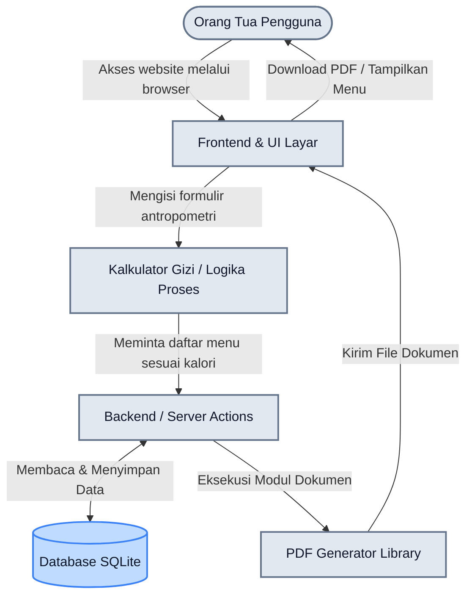
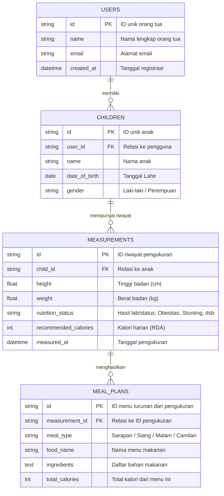

# PRD — Project Requirements Document

## 1. Overview
Banyak orang tua merasa kebingungan dalam memantau status gizi anak mereka (mulai dari bayi hingga usia sekolah dasar) serta tidak tahu memberikan menu makanan yang tepat saat anak mengalami masalah gizi. Aplikasi ini bertujuan menyelesaikan masalah tersebut dengan menyediakan platform website medis yang *user-friendly* dengan tampilan futuristik/modern. Sistem akan secara otomatis menghitung status gizi anak berdasarkan perhitungan antropometri dan menyajikan rekomendasi menu makan yang mudah didapat, sesuai dengan Angka Kecukupan Gizi (AKG/RDA) anak, dan bebas biaya (gratis).

## 2. Requirements
- **Aksesibilitas Tinggi:** Tampilan website harus sangat mudah dioperasikan (user-friendly) oleh beragam kalangan orang tua, namun dibalut dengan desain yang bersih, modern, dan futuristik.
- **Kalkulasi Medis:** Mampu menghitung status gizi (seperti standar Z-score/antropometri WHO atau KMS) berdasarkan berat badan, tinggi badan, usia, dan jenis kelamin anak.
- **Efisiensi Rekomendasi:** Sistem harus bisa mencocokkan hasil perhitungan gizi dengan *database* menu makanan lokal yang bahannya mudah dicari di pasar atau supermarket.
- **Fitur Ekspor:** Menu makanan yang direkomendasikan wajib bisa diunduh sebagai *file* PDF atau langsung dicetak (print).
- **Kapasitas Skala Kecil-Menengah:** Mampu diakses dengan lancar oleh 100 hingga 1.000 pengguna secara bersamaan.
- **Tanpa Biaya Dasar:** Penggunaan website ini dikhususkan secara gratis untuk membantu akses kesehatan yang merata.

## 3. Core Features
- **Kalkulator Gizi Antropometri Pintar:** Formulir input data fisik anak yang secara instan memproses dan menampilkan visualisasi status gizi (Normal, Kurang Gizi, Risiko Stunting, Obesitas) beserta kebutuhan kalori hariannya.
- **Generator Menu Makan Otomatis:** Menghasilkan jadwal makan sehari-hari (Sarapan, Makan Siang, Makan Malam, dan Camilan) secara otomatis dengan porsi yang sudah disesuaikan dengan kebutuhan gizi spesifik sang anak.
- **Tombol "Cetak & Unduh PDF" 1-Klik:** Tombol *action* yang langsung mengubah jadwal makan yang direkomendasikan menjadi dokumen berekstensi PDF yang rapi, siap untuk dipajang di lemari es atau dibawa saat belanja.
- **Manajemen Profil Anak:** Memungkinkan orang tua yang melakukan *login* untuk menyimpan profil lebih dari satu anak, sehingga riwayat perkembangan serta rekomendasi menu makanannya tersimpan dengan aman tanpa harus input ulang data tiap bulan.

## 4. User Flow
1. **Beranda (Landing Page):** Pengguna masuk ke website, disambut oleh desain modern dan penjelasan singkat mengenai fungsi perhitungan gizi gizi.
2. **Registrasi/Akses Cepat:** Pengguna membuat akun atau *login* (menggunakan *email* atau akun Google) agar riwayat data anaknya bisa disimpan.
3. **Input Profil Anak:** Pengguna memasukkan nama anak, tanggal lahir (usia), tinggi badan, berat badan, dan jenis kelamin.
4. **Halaman Hasil (Dashboard Status):** Aplikasi menampilkan hasil grafik status gizi anak saat ini beserta rekomendasi Angka Kecukupan Gizi (AKG/RDA) hariannya.
5. **Kurasi Menu Otomatis:** Di halaman yang sama, muncul daftar menu makanan harian sesuai status gizinya dengan instruksi dan list bahan yang mudah ditemukan sehari-hari.
6. **Ekspor Data:** Pengguna mengklik tombol "Unduh PDF" atau "Cetak", lalu otomatis mendapatkan salinan jadwal makan dan status gizi anaknya.

## 5. Architecture
Aplikasi ini menggunakan rancangan integrasi monolitik modern *(Fullstack)* di mana bagian antarmuka pengguna (Frontend) dan logika server (Backend) dijalankan dalam satu kerangka kerja *(framework)* yang sama. Hal ini memangkas biaya server, sangat cocok untuk skala 1.000 pengguna, dan mempercepat *loading* data.

## 6. Database Schema
Untuk menyimpan data orang tua, informasi sang anak, riwayat perhitungan fisik, serta rekomendasi makanannya, kita membutuhkan struktur basis data relasional sebagai berikut:

- **users:** Menyimpan kredensial dan informasi orang tua.
- **children:** Menyimpan profil anak (terikat dengan *user* orang tuanya).
- **measurements:** Menampung riwayat perhitungan pengukuran gizi pada tanggal tertentu (antropometri).
- **meal_plans:** Riwayat referensi menu makan yang diberikan berdasarkan data pengukuran tersebut.

## 7. Tech Stack
Berikut adalah rekomendasi teknologi untuk pengembangan awal website agar tampil modern (futuristik), mudah digunakan, efisien secara biaya, serta berorientasi pada skala 100-1.000 target pengguna yang disebutkan:

- **Frontend & Backend (Full-Stack Framework):** Next.js (dengan App Router) — Menangani halaman web maupun logika API di satu tempat secara cepat.
- **Antarmuka & Styling (UI):** Tailwind CSS dipadukan dengan shadcn/ui — Memberikan komponen antarmuka pra-bangun dengan gaya sangat modern/futuristik dan responsif.
- **Autentikasi Pengguna:** Better Auth — Simple dan aman untuk sistem pendaftaran/login orang tua.
- **Database Modeller (ORM):** Drizzle ORM — Sangat cepat untuk berkomunikasi dengan *database*.
- **Database Utama:** SQLite (menggunakan Turso atau penyedia SQLite serupa) — Sangat kuat dan ringan untuk menampung lalu-lintas hingga ribuan pengguna harian tanpa biaya *cloud* yang besar.
- **Ekspor Dokumen (PDF Generation):** `react-pdf` atau `jsPDF` — Pustaka (Library) khusus agar tampilan menu dalam HTML langsung dapat di-render menjadi PDF dalam 1 klik.
- **Platform Deployment:** Vercel — Lingkungan ideal dan gratis untuk merilis aplikasi Next.js ke internet (Go-live).